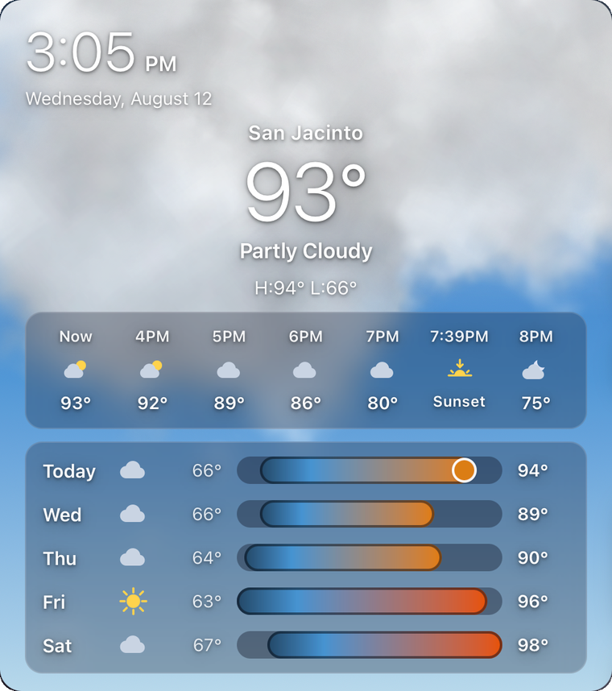
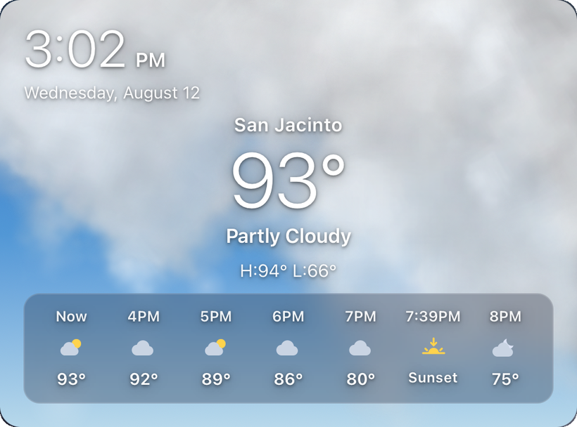

# Animated Sky Weather Card

A Home Assistant weather card where **the whole card is a living sky**. The sun is drawn
where it actually is. The moon rises where it actually is, in its actual phase. Clouds are
volumetric, lit, and as thick as your local cloud cover says they are — and when the weather
turns, the sky turns with it: leaves tumble past on windy days, rain splashes off the hourly
panel, hailstones bounce, snow settles on the edges, lightning branches across a charcoal sky.

No CDN, no telemetry, no API keys, **zero network requests** — every texture is generated and
embedded in the card.

<p align="center">
  
</p>

---

## Highlights

| | |
|---|---|
| **Real sun** | Position from `sun.sun` azimuth/elevation — overexposed core, bloom that lights the sky, diffraction starburst, anamorphic streak and lens ghosts. Hazes to a glow when cloud cover climbs above 70%. |
| **Real moon** | Position **and phase** computed from your latitude/longitude — no extra integration. Fades by illumination and hides when it's too near the sun to be visible. |
| **Volumetric clouds** | Clusters of self-shaded puff sprites in a CSS 3D world, spinning and drifting with depth parallax. Cover drives their size, count and opacity; period-locked drift trains mean an overcast sky never opens a hole. |
| **Weather scenes** | 15 conditions, each with its own look — see the table below. |
| **Panel interaction** | Rain, hail and snow hit the hourly panel: splashes ricochet, hailstones bounce, snow accumulates and melts. Every impact comes from a drop you can watch fall. |
| **Localised** | Dates, times and condition text follow your Home Assistant language and 12/24-hour setting; °C and °F both supported; northern and southern hemisphere skies. |
| **Apple-style layout** | Clock and date, hero temperature and condition, hourly strip with sunrise/sunset inserted at their true times, and daily rows with shared temperature-range bars. |

## The sky in every condition

Fractal vein lightning — branches taper as they split, always entering from off-screen,
with a volumetric glow and a screen-wide flash on the strike.

Fog fills the sky with the same cloud banks rendered as hazy, blurred smears over a milky
wash, so no blue ever shows through.

Snow drifts down and **settles on the hourly panel** — caps grow where flakes land, linger,
then melt.

### Condition map

| Condition | What you see |
|---|---|
| `sunny` / `clear` | Clean sky, real sun, no clouds |
| `partlycloudy` | Scattered smaller clouds, open blue between |
| `cloudy` | Full-size overcast deck, sun hazed behind it |
| `windy`, `windy-variant` | Clouds 1.5× faster and wind-sheared, small leaves tumbling past |
| `fog` | Full-sky hazy banks over a milky wash |
| `rainy` | Dimmed deck, rain, splashes off the hourly panel |
| `pouring` | Charcoal deck, double the rain, falling faster |
| `lightning`, `lightning-rainy` | Storm sky with branching vein bolts and flashes |
| `hail` | Fast ice pellets that bounce off the panel rim |
| `snowy` | Bright snow clouds, drifting flakes, snow settling on the panel |
| `snowy-rainy` | Wet sleet mix — rain plus fast pellets, no bounce |
| `exceptional` | "Severe": dark, still, ominous |
| `clear-night` | Stars, the real moon in its real phase |

Night versions of every scene are automatic, driven by the real sun elevation.

## Compact mode

Set `forecast_rows: 0` for a shorter card — sky, hero and hourly only:

<p align="center">
  
</p>

---

## Installation

### HACS (recommended)

[](https://my.home-assistant.io/redirect/hacs_repository/?owner=mbrande&repository=animated-sky-weather-card&category=plugin)

Or add it by hand:

1. Open **HACS** in Home Assistant
2. Top-right **⋮** menu → **Custom repositories**
3. **Repository:** `https://github.com/mbrande/animated-sky-weather-card`
4. **Type:** `Dashboard`
5. Click **Add**, then find **Animated Sky Weather Card** in the HACS list and click
   **Download**

**HACS registers the dashboard resource for you** — there is nothing else to add.

No Home Assistant restart is needed, but **force-close and reopen the companion
app** (or hard-refresh the browser) so the new resource actually loads.

### Manual

1. Copy `animated-sky-weather-card.js` to `/config/www/`
2. **Settings → Dashboards → ⋮ → Resources → Add resource**
   URL `/local/animated-sky-weather-card.js?v=1`, type **JavaScript module**
   (bump `?v=` on every update — `/local` is cached for ~31 days)

## Usage

```yaml
type: custom:animated-sky-weather-card
entity: weather.home
```

That's the minimum. A fuller example:

```yaml
type: custom:animated-sky-weather-card
entity: weather.home              # temperatures + forecasts
current_entity: weather.kriv      # optional: observed conditions (see below)
coverage_entity: sensor.cloud_cover   # optional: live cloud cover %
city: San Jacinto
forecast_rows: 5
time_format: "12"
```

### Options

| Option | Type | Default | Description |
|---|---|---|---|
| `entity` | string | **required** | Weather entity for temperature, hourly and daily forecasts |
| `current_entity` | string | — | Optional second weather entity used **only** for the current condition. Point this at a national observation integration (NWS, Met Office, DWD, KNMI, Environment Canada) when your forecast provider's "current" condition lags reality. Falls back to `entity`. |
| `coverage_entity` | string | — | Optional sensor reporting cloud cover in **percent**. Drives cloud density directly; without it the condition sets the density. |
| `city` | string | — | Name shown above the temperature. Omit to show none. |
| `forecast_rows` | number | `4` | Daily rows (1–6). **`0` = compact mode**: no daily panel. |
| `time_format` | string | follows Home Assistant | `"12"` or `"24"` to force a clock; omit it and the card uses your Home Assistant time-format setting (which can itself follow your language or system). |
| `locale` | string | follows Home Assistant | BCP-47 tag (e.g. `"de-DE"`) to force date/time formatting. Omit it and the card follows your Home Assistant language, then the browser. |
| `height` | number | `440` (compact: `355`) | Card height in pixels |
| `animation` | boolean | `true` | `false` freezes all motion |

`prefers-reduced-motion` is respected automatically.

### Why `current_entity`?

Forecast models are excellent at temperature and terrible at telling you it's cloudy *right
now*. If your card says "Sunny" while you're looking at an overcast sky, add a nearby
observation-based weather entity as `current_entity`: the card takes the condition (and the
sky it draws) from real observations while keeping your model's temperatures and forecasts.

## Requirements

- A weather entity that supports forecasts (`weather.get_forecasts`)
- `sun.sun` (enabled by default in Home Assistant) for sun position
- Home Assistant's configured latitude/longitude for the moon

## Notes

- **°C and °F are both supported.** The card prints whatever your provider reports; the unit
  (from the entity, else your Home Assistant unit system) is used only to place temperatures on
  the colour scale, so a 30 °C day is coloured as the hot day it is.
- **Both hemispheres are supported.** North of the equator the sun crosses the south and travels
  left to right; south of it the sun crosses the north, so the card mirrors the arc — sunrise on
  the right, sunset on the left, exactly as you would see it facing that path. The moon follows
  the same mapping.
- **Any language.** Dates, weekday names, clock and hourly labels are formatted with the Intl
  APIs in your Home Assistant language (12/24-hour follows your HA setting), and the condition
  text uses Home Assistant's own translated weather states. "Now", "Sunrise" and "Sunset"
  use HA translations where available and fall back to English.
- Textures (clouds, sprites) are procedurally generated — no third-party imagery.

## License

MIT © mikebrande
